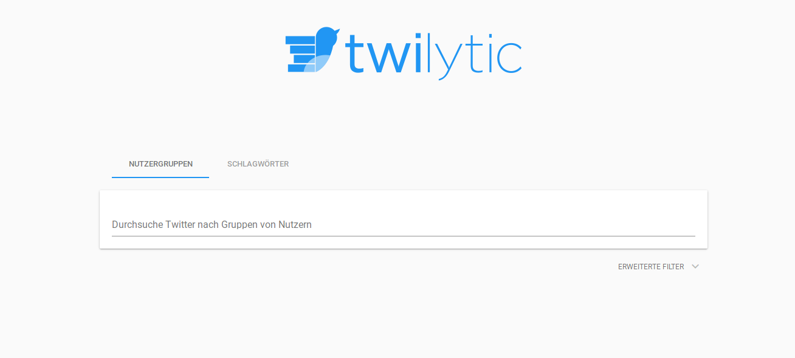
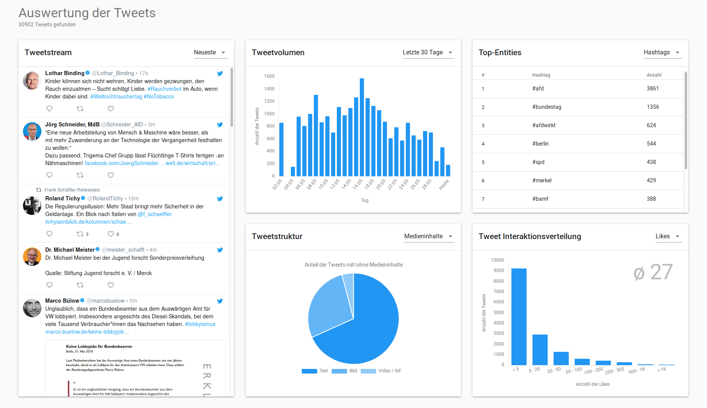

Twilytic
============

A nice & transparent Twitter Analysis Tool built with [React](https://reactjs.org/).

```bash
git clone https://github.com/art1fa/twilytic-client.git
cd twilytic-client
yarn install
yarn start
```

## Screenshots





## About

Twilytic is the outcome of my Master's thesis at the Technical University of Munich. The thesis was issued and supervised by Prof. Dr. Jürgen Pfeffer from the chair of Computational Social Science and Big Data. Thank you so much!